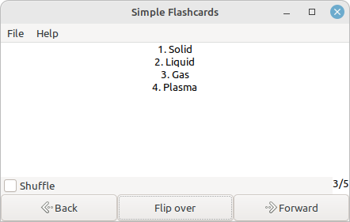

# Simple Flashcards

A simple flashcard viewer. Make a deck of flashcards, and open it in the viewer. See the sample_decks directory for example decks.

# Features

- Shuffle flashcards
- Supports double-sided flashcards
- Easy-to-use file format
- Keyboard shortcuts for almost every action

# Usage

You can run from source, use a prebuilt binary, or build your own binary.

## Running from source (cross-platform)

1. (Optional) Start a virtualenv
2. Install dependencies: `pip install -r requirements.txt`
3. Run `python3 simple-flashcards.py`

## Prebuilt binary (Linux)

1. Download the latest release
2. Extract to some location (for example, /opt)
3. Run the executable (for example, /opt/simple-flashcards/simple-flashcards)
4. Optionally, make a shortcut on the menu or desktop

## Build your own binary (Linux)

1. Install pyinstaller: `pip install pyinstaller`
2. Run `./build.sh`

Note: If it fails, try first running `pip install -r requirements.txt`

# Format of a flashcard deck file

1. Cards are separated by a single empty line
2. A line with three dashes (---) separates the front and back of a card

